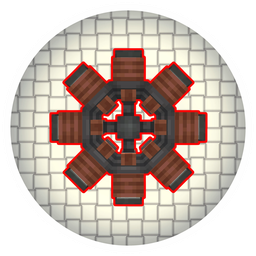

<p align="center"></p>

<h1 align="center">Create: New Age (Fly Port)</h1>

<p align="center">
An <b>unofficial</b> port of <a href="https://gitlab.com/antarcticgardens/create-new-age">Create: New Age</a>
to <a href="https://github.com/ZurrTum/Create-Fly">Create Fly</a>, for Fabric and Minecraft 26.2.
</p>

> [!IMPORTANT]
> This is **not** an official release. Create: New Age is made by **Antarctic Gardens**, and all
> rights to it belong to them. Antarctic Gardens do not maintain, endorse or support this port.
> **Please do not report problems with this port to them.** Use this repository's
> [issue tracker](../../issues) instead.

## What it is

Create: New Age is an addon for Create that brings electricity and nuclear power into the world
of rotational force. This port carries the mod over, feature for feature, from NeoForge 1.21.1
to Create Fly, the Fabric port of Create for Minecraft 26.2.

- **Generating power**: generator coils spun inside rings of magnets, collected with carbon brushes
- **Wiring**: electrical connectors joined by copper wire and overcharged iron, gold and
  diamond wire
- **Using power**: electric motors (basic, advanced, reinforced) with motor extensions, energisers
  that charge items on a depot or belt, and street lights and lamp posts
- **Heat**: heat pipes and pumps, solar heating plates, heaters that warm basins and boilers like a
  blaze burner, and the stirling engine
- **Nuclear**: thorium, nuclear fuel, reactor rods, casings, heat vents and radiation
- **Ponder scenes** for the main machines

## Requirements

| | Version |
|---|---|
| Minecraft | 26.2 |
| Fabric Loader | 0.19.3 or newer |
| [Fabric API](https://modrinth.com/mod/fabric-api) | 0.160.0+26.2 or newer |
| [Create Fly](https://modrinth.com/mod/create-fly) | 26.2-rc-2-6.0.9-1 or newer |

Optional:

- [JEI](https://modrinth.com/mod/jei) shows the energising recipes.
- [CC: Tweaked](https://modrinth.com/mod/cc-tweaked) exposes motors, energisers and carbon brushes
  as peripherals.

The mod is needed on both the server and the client.

## Differences from the original

- **Energy API**: NeoForge's energy capability is replaced by
  [Team Reborn Energy](https://github.com/TechReborn/Energy) (bundled), the common energy API on
  Fabric. Machines exchange energy with other Fabric mods that use it.
- **Configuration**: the settings are the same as the original's and live in
  `config/create_new_age-server.toml` and `config/create_new_age-client.toml`.
- **Monkey edition**: the original's alternative recipe datapack is still bundled and can be turned
  on in the datapack screen.

## Installation

1. Install Fabric Loader for Minecraft 26.2.
2. Put Fabric API, Create Fly and this mod's `.jar` from the
   [releases](../../releases) into your `mods` folder.

## Building from source

You need **JDK 25**. Gradle finds an installed JDK 25 by itself, even if your `JAVA_HOME`
points to an older one.

```bash
./gradlew build
```

The mod jar ends up in `build/libs/`.

```bash
./gradlew runClient                       # development client
./gradlew runClientGameTest               # automated render and gameplay checks, screenshots in build/run/clientGameTest/screenshots
```

Notes about the port, the decisions behind it and the traps found along the way are in
[`PORTING.md`](PORTING.md).

## Credits

- **Antarctic Gardens**: Create: New Age, its code and its assets. See [`CREDITS.md`](CREDITS.md)
  for everyone who contributed models, textures and translations to the original.
- **ZurrTum**: [Create Fly](https://github.com/ZurrTum/Create-Fly).
- **The Create team**: [Create](https://github.com/Creators-of-Create/Create).

## Licence

Create: New Age is © 2023 Antarctic Gardens and distributed under a BSD-style licence; see
[`LICENSE`](LICENSE). This port keeps that licence and its copyright notice. The names of the
original authors are used only to credit them, not to promote this port.
